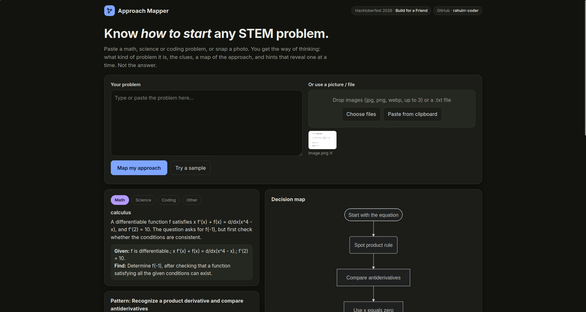

# Approach Mapper

You're stuck on a STEM problem and don't know where to start. Paste it (or snap a photo) and Approach Mapper gives you **the way of thinking**: the clues in the problem, the pattern or method that fits, a decision-path mindmap, step-by-step questions to ask yourself, and a 4-level hint ladder you reveal one click at a time. The answer is never the headline.

Built for [@harishb2006](https://github.com/harishb2006) who learns DSA and math and gets stuck at the blank page.





## Open source, bring your own model
The code is MIT-licensed and model-agnostic. It talks to any OpenAI-compatible chat API, so *you* choose where the model runs by setting three env vars (`LLM_BASE_URL`, `LLM_API_KEY`, `LLM_MODEL`):

- **Run a model locally** if your hardware allows: Ollama, LM Studio, vLLM or llama.cpp's server, with any open-weight model (use a vision-capable one if you want image input). Nothing leaves your machine.
- **Hardware too limited?** Point it at [OpenRouter](https://openrouter.ai) or any hosted cloud API with an API key. Same code, no changes.

No provider-specific code, no lock-in: swapping models or hosts is an env-var change. Text input works on any model; images need a vision-capable one.

Honest note: the app is only as local as the endpoint you configure. If you use a hosted API, your problem text and images are sent to that provider. Small models give weaker results, and any model can be wrong, so treat the output as a guide.

## Quick start
```bash
git clone <this repo> && cd approach-mapper
python3 -m venv .venv && . .venv/bin/activate
pip install -r requirements.txt
cp .env.example .env     # then fill in the three LLM_* values
uvicorn app.main:app --reload
```
Open http://localhost:8000. CLI check: `python -m app.llm "Two Sum" [image.jpg]`.

## Configuration
| Var | Meaning | Default |
|---|---|---|
| `LLM_BASE_URL` | OpenAI-compatible base URL | required |
| `LLM_API_KEY` | provider key (never commit; any non-empty value for local servers) | |
| `LLM_MODEL` | model id as listed by the provider | required |
| `LLM_TIMEOUT_SECONDS` | request timeout | 120 |
| `MAX_IMAGE_PX` | longest image side before upload | 1600 |
| `MAX_UPLOAD_MB` | per-file upload limit | 8 |

Example `LLM_BASE_URL` values (check each provider's docs for current model ids):
- OpenRouter: `https://openrouter.ai/api/v1`
- Gemini (OpenAI-compatible): `https://generativelanguage.googleapis.com/v1beta/openai/`
- Ollama: `http://localhost:11434/v1`
- LM Studio: `http://localhost:1234/v1`

Switching provider = changing only these env vars; there is no provider-specific code. Text input works on any model; images need a vision-capable one (otherwise you get a friendly message).

## Limitations
- Handwriting and photo quality limit what the model can read (unclear parts are listed, not guessed).
- Small models produce weaker maps; JSON may need a retry.
- The model can be wrong. No history, accounts or multi-page memory.

## Tests
`pytest` (schema + API tests use a mocked LLM; no key needed).

## License
MIT
